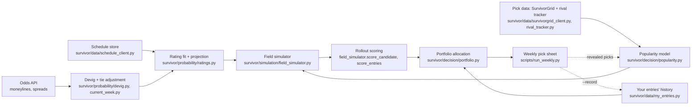

# Survivor

Decision pipeline for the NFL survivor pool. See [plan.md](plan.md) for the
full design (goal, method, phases, technical notes) and its "Progress"
section at the top for phase-by-phase status.

## How it works

Data flows from three free/cheap sources through four layers to a weekly
pick sheet; revealed picks feed back into the popularity model each week
(dashed edge). Module paths are the actual code behind each box.



Everything through the weekly pick sheet (Phases 0-7's pipeline piece) is
built and tested; see Status below for what's still open within Phase 7
and Phase 8's feedback loop.

## Setup

```bash
python3 -m venv .venv
.venv/bin/pip install -e ".[dev]"
cp .env.example .env   # fill in THE_ODDS_API_KEY (thin free tier: 500 req/month)
```

## Run tests

```bash
.venv/bin/pytest
```

## Weekly recommendation

`run_weekly.py` is the actual production entry point: refreshes real data
(schedule free/ESPN, current-week odds live via The Odds API -- on by
default here, since a real weekly decision is exactly the case worth
spending quota on) and recommends a per-entry allocation across every team
playing that week, via `greedy_local_entry_allocation` (Phase 6). Entries
are named `entry_1..entry_N` and their history is read from
`survivor.data.my_entries` (`data_store/my_entries/`) -- nothing recorded
yet (true before Week 4) just means every entry is alive with an empty
used-teams set, handled like any other state, not a special case. Ratings
are fit on every real week so far this season combined (one free
SurvivorGrid pull per past week, plus this week's real odds), not the
current week alone -- see Status below for why. Saves the pick sheet to
`data_store/pick_sheets/`.

```bash
.venv/bin/python scripts/run_weekly.py --week 4                         # real run, live odds pull
.venv/bin/python scripts/run_weekly.py --week 4 --skip-odds-refresh     # reuse cached odds (or backtest a past week)
.venv/bin/python scripts/run_weekly.py --week 4 --n-paths 5000          # quick/rough look
.venv/bin/python scripts/run_weekly.py --week 4 --n-entries 10 --n-rivals 500
.venv/bin/python scripts/run_weekly.py --week 4 --record                # also commit picks into data_store/my_entries/
```

Default `--n-paths 20000` runs in about half a minute (measured offline,
before the network calls); raise it (e.g. 80000) for the final pre-lock
decision. The rival field is simulated with a "ghost" estimator whose cost
doesn't depend on field size, so `--n-rivals` can be the real number. From
Week 5 on, paste the pool's per-team availability table (live entries that
can still pick each team) into a file and add `--rival-availability FILE`
to start rivals from their real used-team rates; see the script's docstring
for what was validated and the one known bias.

`--record` commits this run's recommendation as each entry's pick for
`--week`; without it, a run is just a look. Marking who actually won or
lost (`survivor.data.my_entries.record_result`) is a separate, manual step
for now -- there's no automated results feed yet.

Known simplification: assumes your entries have no picks locked in before
`--week` (true today -- confirm before reusing this for a mid-season week).

## Pull real data without a recommendation

Schedule (ESPN) and pick percentages (SurvivorGrid) are free and keyless.
Odds (The Odds API) is quota-limited and only pulled when asked. Everything
lands under `data_store/` (git-ignored, not committed) as timestamped raw
pulls plus a `latest.csv` per source.

```bash
.venv/bin/python scripts/refresh_all.py                 # schedule + pick percentages
.venv/bin/python scripts/refresh_all.py --odds           # + a live odds pull (uses API quota)
.venv/bin/python scripts/refresh_all.py --pick-week 5
```

Other one-off scripts under `scripts/`: `backfill_rating_history.py` and
`collect_historical_*.py` pull multi-season SurvivorGrid history for
calibration/validation; `backtest_week1.py` replays the pipeline blind
against a past week; the `validate_*.py` scripts check each phase's
acceptance criteria against whatever is cached in `data_store/` (no new API
calls). Run these after `refresh_all.py` — several expect `data_store/`
to already be populated.

## Layout

- `survivor/data/` — ingestion and storage (Phase 1): odds, schedule, and
  SurvivorGrid clients, team-key normalization, rating history, the rival
  tracker (`rival_tracker.py`, other entrants' picks), and the entry
  tracker (`my_entries.py`, your own entries' picks and survival).
- `survivor/probability/` — devigging, spread-to-probability, team rating
  fit and projection (Phases 2-3).
- `survivor/decision/` — pick popularity model, payout objective, and joint
  portfolio allocation across entries, including the entry-aware search for
  once entries have diverged (Phases 4, 6).
- `survivor/simulation/` — field simulator, base-policy assignment, and
  rollout scoring (Phase 5).
- `scripts/run_weekly.py` — the production entry point (Phase 7's pipeline
  piece): refresh data, fit ratings, simulate, recommend, archive, and
  optionally record.

## Status

Phases 0 through 6 are done — data ingestion, current- and future-week win
probabilities, the pick popularity model, the Monte Carlo field simulator
with rollout scoring, and joint portfolio allocation across entries
(including entries with diverged histories, from Week 5 onward), all wired
up and tested (176 tests passing). Phase 7's pipeline piece is also done:
`scripts/run_weekly.py` refreshes real data, fits ratings on every real week
so far this season combined (not just the current week -- see below),
runs the simulator, recommends a per-entry allocation, archives the pick
sheet, and optionally records it. A blind Week 1, 2026 backtest
(`scripts/backtest_week1.py`) ran the full pipeline end to end
successfully.

One open validation item: Phase 3's lookahead cross-check (projected
spreads within ~1.5 points of real lookahead lines) hadn't passed as of its
first commit. Revisited: fitting ratings on every real week so far this
season combined, instead of just the current week, plus a small ridge
(`DEFAULT_SEASON_TO_DATE_RIDGE`), brought the real Week 4, 2026 lookahead
MAE from 2.39 down to 1.73 — a real, validated improvement, but still short
of the 1.5-point bar. See plan.md's Phase 3 section for the full diagnosis
(it's almost entirely single-week-fit noise, not real team-strength
change) and what didn't help (recency weighting). Worth rechecking again as
more real weeks accumulate.

Phase 6's 5-random-seed stability check is resolved. It initially came back
a near-tie rather than a clean pass against real Week 4, 2026 data (entries
shuffled between candidate teams across seeds); escalating precision 4x
didn't change that, which pointed toward "these allocations are genuinely
close" rather than "needs more precision." Confirmed that directly and
cheaply using `AllocationResult`'s paired `gap_to_best`/`gap_to_best_se`
(common random numbers keep its standard error far below either
allocation's own) on a single already-computed simulation: all 10 of the
top 10 allocations were within 2 SE of the best one. A genuine near-tie,
exactly what the plan's own "or the result is flagged as a near tie"
clause allows — `validate_portfolio.py` now runs this check automatically
whenever seeds disagree. The 2-percentage-point probability-shift check
passed cleanly. That same investigation also found that the all-candidate
greedy search beats exhaustive search restricted to the top 5 by survival
probability by a real, non-noise margin — see plan.md's Phase 6 section,
which also has a real bug found and fixed in that search's local-search
step along the way.

Not yet built: Phase 7's actual lock-day behaviors (Thursday-vs-wait
staging, 1pm Eastern cutoff awareness, submission automation, and
determining the real field size instead of passing it in by hand), most of
Phase 8 (the rival tracker and your own entry tracker both exist as storage
layers, but popularity refinement from the tracked field, split-decision
logic, and the exact endgame solver are still open, and there's no
automated results feed yet — marking who won or lost is a manual step), and
Phase 9 (a hosted, multi-user/multi-league version — planned in plan.md,
not started). See [plan.md](plan.md)'s "Progress" section for the full
phase-by-phase breakdown.

This checkout has no `.env` or `data_store/` populated (both git-ignored) —
run the Setup and "Pull real data" steps above before running scripts that
touch real data.
