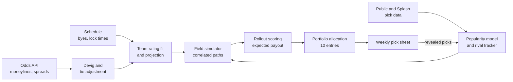

# NFL Survivor Pool Model: Planning Document

*Sep 24, 2026 · @Megan*

## Progress as of September 25, 2026

Phases 0 through 5 are done, all in one day and well ahead of the Sep 25-Oct 2
schedule below. See [README.md](README.md) for how to run things and the one
open validation gap. Status by phase:

- **Phase 0 (Rules and data access):**
  confirmed - every downstream phase proceeded
- **Phase 1 (Data ingestion):** done. Odds, schedule, and SurvivorGrid
  pick-percentage clients are built and tested, team keys normalize across
  all three sources, and `scripts/refresh_all.py` is the one-command
  refresh.
- **Phase 2 (Current-week probabilities):** done. Devig plus tie adjustment
  is wired to real odds and validated against a published devigged
  consensus (`scripts/validate_current_week.py`).
- **Phase 3 (Future-week probabilities):** done, with one open item, revisited
  and improved but not fully resolved. The rating fit meets the in-sample
  spread-reproduction bar; the lookahead cross-check bar (projections within
  ~1.5 points of real lookahead lines) had not been met as of the first
  Phase 3 commit (single-week fit: 2.39 MAE on real Week 4, 2026 lines).
  Diagnosed the likely cause using the same noise-vs-drift decomposition
  from `DEFAULT_WEEKLY_RATING_STD`'s investigation: a single week's fit is
  16 games informing 32 teams' ratings, almost entirely noise
  (`sigma_noise≈2.16`, next to essentially no real week-to-week drift,
  `sigma_drift≈0.40`), and that noise is most of what the lookahead
  error measures. Fixed by fitting on every real week so far this season
  combined, not the current week alone
  (`survivor.data.survivorgrid_client.fetch_season_to_date_games`, free
  SurvivorGrid pulls, one per past week) plus a modest ridge (added
  `weights` support and `DEFAULT_SEASON_TO_DATE_RIDGE=0.2` to
  `fit_team_ratings`/`ratings.py`). On real Weeks 1-3 fit, Week 4 held out:
  MAE went 2.39 (single week) → 2.01 (3 weeks, no ridge) → 1.73 (3 weeks +
  ridge) — a real, validated 28% improvement, but still short of the 1.5
  bar. Tried recency weighting first as an alternative lever; it didn't
  help at all, consistent with the tiny drift finding — there's essentially
  no "recent form" signal yet to weight toward. Errors are broadly spread
  across games (0.43-4.11), not a couple of outliers, so the residual gap
  is plausibly real-time news a backward-looking spread fit can't see, plus
  still-limited history (3 games/team). `scripts/run_weekly.py` now fits
  this way (real spread data through the current week) rather than the
  current week alone. Revisit `scripts/validate_ratings.py` as more real
  weeks accumulate -- both more fitting data and, eventually, more than one
  held-out lookahead week to validate ridge against.

  Separately, `DEFAULT_WEEKLY_RATING_STD` (weekly rating-uncertainty) was
  revisited using real week-over-week rating history
  (`survivor/data/rating_history.py`, backfilled from 2023-2025) and kept
  at 1.0 rather than either raw calibration estimate; the reasoning is
  recorded as a comment on `DEFAULT_WEEKLY_RATING_STD` in
  `survivor/probability/ratings.py`.
- **Phase 4 (Pick popularity model):** done. The softmax popularity model is
  fit and beats both the uniform and win-probability-proportional baselines
  on held-out historical log loss.
- **Phase 5 (Field simulator and rollout scoring):** done, all three
  acceptance criteria met against real Phase 1-4 data (80,000 paths, ~500
  rivals, Weeks 4-18) — see `scripts/validate_simulator.py` and
  `validate_elimination_curve.py`.
  - Extra validation beyond the phase list: `scripts/backtest_week1.py` ran
    the full pipeline blind against real Week 1, 2026 pre-game data, never
    reading the result until after the recommendation was produced. It
    recommended DET (which survived), and surfaced and fixed a real
    SurvivorGrid neutral-site parsing bug along the way.
- **Phase 6 (Portfolio allocation and validation):** scoring engine built
  (`survivor/decision/portfolio.py`: `enumerate_allocations`,
  `score_allocation`, `best_allocations`), including a real correctness fix
  — `score_allocation` correctly splits the pot when several of your own
  entries share a winner set, which `field_simulator.score_candidate` alone
  can't do, since it scores one entry as if it were your only one. Added a
  `greedy_local_allocation` search (greedy construction plus pairwise local
  search) alongside the exhaustive one, since `enumerate_allocations` is
  combinatorial in candidate-team count and can't scale to all ~32 teams
  playing a week; validated against exhaustive search on a small enumerable
  case, where it finds the true optimum. `AllocationResult` now also
  carries a paired gap-to-best and its standard error (common random
  numbers, not an independent-SE combination), so a UI can tell genuine
  ties from real differences.

  Ran `scripts/validate_portfolio.py` against real Week 4, 2026 data
  (5,000 paths, 500 rivals, top-5 candidates by survival probability). The
  2-percentage-point probability-shift criterion passed cleanly. The
  5-random-seed criterion didn't pass strictly — the top allocation
  shuffled entries between MIN/BUF/KC across seeds, mean payouts spanning
  333-357. Resolved, not just left as an open item: tried escalating
  precision first (20,000 paths, 4x the original) and the instability
  didn't budge, which pointed away from "just needs more precision" and
  toward "these allocations are genuinely close." Confirmed that directly
  and far more cheaply using `AllocationResult`'s own `gap_to_best`/
  `gap_to_best_se` (a paired comparison via common random numbers, so its
  standard error is much smaller than either allocation's own raw SE) on
  a single simulation already computed by `best_allocations`, no extra
  runs needed: all 10 of the top 10 allocations were within 2 SE of the
  best one (gaps of 0-1.75, paired SE 0-2.37, against a raw per-allocation
  SE of ~20) — a genuine near-tie, not insufficient precision. This is
  exactly the plan's own "or the result is flagged as a near tie" clause,
  now properly confirmed rather than just suspected.
  `validate_portfolio.py` now runs this diagnostic automatically whenever
  the 5-seed check fails, instead of leaving it as a manual follow-up.

  The same run surfaced a real finding, not just a performance one:
  restricting to the top 5 candidates by survival probability and
  enumerating exhaustively (14.4s, mean payout 349.77) left real value on
  the table versus `greedy_local_allocation` searching all 32 teams playing
  that week (1.7s, reusing a once-per-week precomputed elimination array
  set that itself took 81s to build) — mean payout 397.28, a paired gap of
  47.5 ± 9.96 SE, clearly not noise. Consistent with the project's central
  thesis (expected payout isn't survival probability): a team outside the
  survival-probability top 5 had better leverage. Worth using the
  all-candidate greedy search as the default going forward, not just a
  fallback for when exhaustive search is too slow.

  Extended for entries with diverged histories (needed from Week 5 onward,
  once entries have picked different teams and some may be eliminated --
  see `survivor/data/my_entries.py`): `score_entries` is a new core
  primitive working from each entry's own elimination-week array rather
  than team counts, since even two entries on the *same* team this week
  aren't interchangeable once their own prior picks differ (each one's
  future max-survival assignment excludes different already-used teams).
  `score_allocation` is now a thin wrapper over it (refactor only, all
  existing tests pass unchanged). `greedy_local_entry_allocation` is the
  per-entry search, results cached by (used-teams signature, team) so
  entries who haven't diverged yet don't duplicate Hungarian-assignment
  solves. Caught a real bug while validating it against exhaustive
  enumeration on a small case: single-entry local-search moves alone got
  stuck in a local optimum (96.86 vs. the true 97.55) whenever reaching the
  best assignment required two entries trading teams simultaneously —
  fixed by adding a pairwise-swap move alongside the single-entry one.
- **Phase 7 (Lock day):** the "weekly pick sheet" piece exists
  (`scripts/run_weekly.py`: refresh real data, fit current ratings, run the
  simulator, recommend a per-entry allocation via
  `greedy_local_entry_allocation`, archive it to `data_store/pick_sheets/`,
  and — with `--record` — commit it into `survivor/data/my_entries.py`'s
  tracker), but the actual lock-day behaviors don't — no Thursday-vs-wait
  stage-1/stage-2 logic, no awareness of the 1pm Eastern cutoff, no
  submission automation, and the real field size still has to be passed in
  by hand via `--n-rivals` (or, from Week 5, read from the pool's
  availability table via `--rival-availability`). Marking who actually won or lost each week
  (`record_result`) is still a manual step, no results feed yet. Verified
  the empty-tracker case (true going into Week 4: every entry alive, no
  used teams) produces byte-for-byte the same recommendation
  `greedy_local_allocation` would have, with no extra runtime — confirmed
  directly, not just argued, before treating it as safe to wire in
  unconditionally rather than branching on whether history exists.
  Scheduled for October 1 (Thursday option only) and October 4.
- **Phase 8 (In-season additions):** only the rival tracker's storage layer
  is built ahead of need (`survivor/data/rival_tracker.py`: record/read
  revealed picks, used-team sets, per-week pick distributions). It has no
  real data yet since Week 4 hasn't happened. Popularity refinement from the
  tracked field, split-decision logic, and the exact endgame dynamic
  program are all not started.
- **Phase 9 (Hosted multi-user version):** planned, not yet built — see
  below.

## Goal

Build a decision pipeline that maximizes expected total payout across 10
entries in the traino Splash Sports survivor pool, and have it producing a
Week 4 recommendation before the Sunday, October 4, 1:00 PM Eastern lock.

### Planning assumptions

- **Field:** 500 entries at $20, 10% rake, pot of about $9,000. About 200
  entries were already in by September 25. Actual size is unknown until
  October 4, so every model run sweeps a range of field sizes.
- **Horizon:** Weeks 4 through 18, which is 15 picks from 32 teams.
  Survivors after Week 18 split the pot, as do entries eliminated together
  in the same week.
- **Stake:** 10 entries, $200 total, about 2% of a 500-entry field. The rake
  sets a hurdle of more than 10% edge over the average entry.
- **Locks:** each game locks at kickoff, with a hard cutoff of Sunday 1:00
  PM Eastern for all remaining games. Ties count as losses. Thursday picks
  are revealed to all entrants at Thursday kickoff, and the Thursday result
  is known before the Sunday lock.
- **Objective:** expected payout, not survival probability. These differ
  because payout depends on how many rivals survive with you.

## Method overview

The method is decision theory on top of betting-market probabilities,
solved by Monte Carlo simulation of the whole field. It is not a learned
model: roughly 18 decisions a season and path-dependent outcomes leave
nothing to fit, and the closing line beats any in-house game model at the
heavy favorites survivor picks cluster on.

Four layers, each feeding the next:

1. **Probability layer.** Current-week win probabilities come from devigged
   moneylines, meaning the bookmaker margin (vig) is removed with a power
   or Shin method, then a small tie probability is subtracted. Future-week
   probabilities come from market-implied team ratings fit to current
   spreads, projected forward and converted to win probability assuming
   final margins are normal around the spread with a standard deviation of
   about 13 to 14 points.
2. **Field layer.** A pick popularity model predicts which teams rival
   entries choose, conditioned on each rival's remaining teams. Week 4 uses
   public national pick data. From Week 4 Thursday onward, each of the
   roughly 500 rival entries is tracked individually from revealed picks,
   updated twice a week: after Thursday kickoff and after the Sunday lock.
3. **Decision layer.** Candidate picks are scored by expected payout using
   rollout: simulate the rest of the season with a base policy for your own
   future picks, such as the maximum-survival team assignment over
   remaining weeks.
4. **Portfolio layer.** The 10 entries are optimized jointly, since 10
   entries on one team is one bet at 10 times the stake. The top 5 or so
   candidate teams are enumerated across entry allocations each week.

Two modeling rules matter most:

- **Correlated rating uncertainty.** Each simulation path samples every
  team's true rating once and uses it for all remaining weeks. A team worse
  than believed is worse every week, which is the real risk in saving teams
  for later. Independent per-game sampling understates it.
- **Exact endgame.** Once roughly 10 or fewer entries remain, switch from
  simulation to exact dynamic programming over the joint state of all
  survivors' remaining teams.

## Infrastructure and pipeline overview

The pipeline runs once per week, with a final refresh as close to each lock
as possible. Data flows from three sources through the four layers to a
weekly pick sheet for 10 entries.

The dashed edge is the weekly feedback loop: revealed picks update rival
states and the popularity model twice a week, once after Thursday kickoff
for the Sunday decision and once after the Sunday lock for the next week.

### Components and their stored outputs

| Component | Input | Output |
| --- | --- | --- |
| Odds ingestion | Odds application programming interface (API), multiple books | Raw moneylines and spreads, timestamped |
| Schedule store | Official schedule | Games per week, bye weeks, per-game lock time |
| Probability layer | Lines, schedule | Win probability per team per week, plus rating uncertainty |
| Popularity model | Public pick percentages, revealed Splash picks | Pick distribution per rival state |
| Rival tracker | Revealed Splash picks | Used-team set per rival entry |
| Field simulator | All of the above | Simulated season outcomes and payouts |
| Decision and portfolio layers | Simulator output | Recommended pick per entry, with expected payout |

## Plan phases

Phases 0 through 7 must finish before the October 4 lock. Phase 8 is built
during the season, when each piece is first needed. Phase 9 runs in
parallel, on its own timeline. Phase 3 includes a September 29 checkpoint
because a Thursday Week 4 pick would pull the deadline forward to October 1.

### Phase 0: Rules and data access

- **What:** confirm the open rules and secure data sources.
- **Why:** unresolved rules change which teams are available and what the
  rival tracker can see.
- **How:**
  - confirm that Sunday picks are revealed after the 1:00 PM lock (Thursday
    picks are already confirmed as revealed at Thursday kickoff)
  - confirm odds source coverage by book and how many weeks of lookahead
    lines it provides
- **When:** September 25.
- **Done when:** every rule in the Goal section is confirmed in writing or
  from the picksheet, and a test pull from the odds source succeeds.

### Phase 1: Data ingestion

- **What:** automated pulls of lines, schedule, and public pick data into
  timestamped storage.
- **Why:** every later phase depends on clean, reproducible inputs, and
  lines must be refreshed right before each lock.
- **How:**
  - scheduled pulls from the odds source for all games Weeks 4 through 18
  - a schedule table with bye weeks and per-game lock times
  - a normalized team key shared across all sources
- **When:** September 25 to 27.
- **Done when:** one command refreshes all sources, every Week 4 game has
  lines from at least 3 books, and team keys join across sources with zero
  mismatches.

### Phase 2: Current-week probabilities

- **What:** devigged, tie-adjusted win probabilities for the current week.
- **Why:** this is the single most important input to each week's
  decision.
- **How:**
  1. convert moneylines to implied probabilities
  2. remove the vig with a power or Shin method
  3. take a consensus across books
  4. subtract a small tie probability
- **When:** September 27.
- **Done when:** each game's two probabilities plus tie probability sum to
  1, and consensus values sit within about 1.5 percentage points of a
  published devigged consensus.

### Phase 3: Future-week probabilities

- **What:** projected win probabilities for Weeks 5 through 18, with rating
  uncertainty.
- **Why:** future value, the cost of using a strong team now, is where most
  early-season decisions are won or lost.
- **How:**
  - fit one rating per team plus home-field advantage to current spreads
  - project future spreads
  - convert to probability with a margin standard deviation of about 13 to
    14 points
  - set rating uncertainty that widens with weeks ahead
  - cross-check against lookahead lines where they exist
  - flag Week 17 and 18 games where a team may have clinched and widen
    their uncertainty for possible resting starters
- **When:** September 28 to 29. Checkpoint on September 29: run a rough
  ranking to decide whether either Week 4 Thursday team is a serious
  candidate, weighing its advantage against the value of waiting for
  revealed Thursday picks and the result.
- **Done when:** fitted ratings reproduce current spreads with mean
  absolute error under 1 point, projections sit within about 1.5 points of
  available lookahead lines, and the Thursday decision is made.

### Phase 4: Pick popularity model

- **What:** predicted pick distribution for rival entries, given each
  rival's available teams.
- **Why:** leverage, gaining equity when popular picks lose, depends
  entirely on this forecast.
- **How:**
  - Week 4 uses published public pick percentages
  - future weeks use a softmax over available teams' win probabilities,
    with the temperature fit to historical public pick data
- **When:** September 29.
- **Done when:** on held-out historical weeks, the model's log loss beats
  both a uniform baseline and a baseline proportional to win probability.

### Phase 5: Field simulator and rollout scoring

- **What:** Monte Carlo simulation of the full season for the whole field,
  scoring each candidate pick by expected payout. Each week is a two-stage
  decision: whether to pick a Thursday game before Thursday kickoff, then
  the Sunday pick conditioned on revealed Thursday picks and the Thursday
  result.
- **Why:** this is the core engine that turns probabilities and popularity
  into a decision.
- **How:**
  - per path, sample team ratings once, then per week sample rival picks,
    sample outcomes, apply eliminations and the split rules
  - your own future picks follow the maximum-survival assignment base
    policy
  - stage 1 compares each Thursday option against the expected payout of
    waiting, and stage 2 reruns on the observed field
  - sweep field sizes from 350 to 700
- **When:** September 30 to October 2.
- **Done when:** Monte Carlo standard error on each candidate's expected
  payout is smaller than the gap between the top 2 candidates, simulated
  elimination curves fall within historical survivor pool ranges, and a
  full run finishes in under 30 minutes, fast enough to rerun between
  Thursday night and Sunday.

### Phase 6: Portfolio allocation and validation

- **What:** joint allocation of 10 entries across the top candidates, plus
  end-to-end checks.
- **Why:** entries optimized independently tend to pile onto the same team
  and become one bet.
- **How:**
  - enumerate allocations of 10 entries across the top 5 or so teams (about
    1,000 allocations, still small enough to score exhaustively) and score
    each by total expected payout
  - rerun with different random seeds and small perturbations to
    probabilities
- **When:** October 3.
- **Done when:** the top allocation is the same across 5 random seeds and
  survives a 2 percentage point shift in the leading team's win
  probability, or the result is flagged as a near tie.

> **League configuration (future).** This build hardcodes the current
> league's rules directly: a 25-entry cap
> (`survivor/decision/portfolio.py`'s `MAX_ENTRIES`), and the pot, rake, and
> stake numbers from the Goal section's planning assumptions. That's a
> deliberate simplification for a single-user, single-league tool built
> under deadline, not a limitation of the underlying model. Now planned,
> not just hypothetical — see Phase 9 below for turning this into a real
> per-league config once other users are involved.

### Phase 7: Lock day

- **What:** final refresh and submission.
- **Why:** lines and injury news move until kickoff, and field size is only
  known at the deadline.
- **How:**
  - if Phase 3 selected a Thursday team: enter and pick it before Thursday,
    October 1 kickoff
  - otherwise: load revealed Thursday picks and the result after kickoff,
    then on October 4 refresh lines, rerun with the actual entry count,
    decide entry count (up to 10), and submit
- **When:** October 1 before Thursday kickoff (Thursday option only) and
  October 4, before 1:00 PM Eastern.
- **Done when:** all entries are submitted and the run's inputs and outputs
  are archived for later review.

### Phase 8: In-season additions

- **What:**
  - rival tracker with twice-weekly ingestion after Thursday kickoff and
    after the Sunday lock (from Week 4 Thursday)
  - popularity refinement from your field (Weeks 5 to 8)
  - split decision logic (Week 8 onward)
  - exact endgame dynamic programming (when roughly 10 or fewer entries
    remain)
- **Why:** each becomes useful only once the data or the situation exists.
- **How:**
  - load revealed picks weekly
  - reweight popularity toward observed field behavior
  - compute each survivor's continuation equity for split decisions
  - enumerate joint survivor states in the endgame
- **When:** as triggered, each built the week before it is needed.
- **Done when:** the rival tracker matches Splash's reported survivor count
  every week, and the endgame solver agrees with the simulator on small
  test states.

### Phase 9: Hosted multi-user version

Its own project alongside the rest of this plan, not a build step within
it — tracked here at the level of the overall idea; see
[hosting_plan.md](hosting_plan.md) for the actual planning detail
(platform choice, data model, MVP scope, build order) and to keep working
through it.

- **What:** turn this from a single-user CLI/scripts pipeline into a small
  hosted web app so a small group of people can each run their own league
  (own entry cap, buy-in, rake, pot, week range) through the same pipeline,
  with basic accounts. A league can have more than one person in it, e.g.
  two people sharing the same real-world pool.
- **Why:** the model and scoring engine are already league-agnostic —
  Phase 6's portfolio module takes entry count as a parameter, not a
  constant. What's missing is a place for multiple people's league rules
  and entries to live, and a way to reach the tool without a terminal and a
  personal `data_store` folder.
- **When:** targeting live for Week 4 or shortly after, in parallel with —
  not blocking — Phase 7's October 4 lock-day submission for your own 10
  entries, which ships through the existing scripts regardless of how this
  phase is going.
- **Done when:** at least one other person can log in, configure their own
  league's rules, and see that league's weekly recommended allocation
  without touching the command line or your `data_store` folder.

## Technical dependencies

The critical-path dependency is the odds source: without multi-book lines
and some lookahead coverage, Phases 2 and 3 cannot meet their acceptance
metrics.

| Dependency | Needed by | Purpose | Risk if missing |
| --- | --- | --- | --- |
| Odds application programming interface (API) with multiple books | Phase 1 | Moneylines and spreads, current and lookahead | Blocks Phases 2 and 3; fall back to a single book and wider uncertainty |
| Official 2026 schedule with bye weeks and kickoff times | Phase 1 | Game availability and per-game lock times | Wrong availability in the simulator |
| Public pick percentage source | Phase 4 | Week 4 popularity and historical fitting data | Popularity model reduces to a guess |
| Historical survivor pool elimination and pick data | Phases 4 and 5 | Fitting the softmax temperature and validating simulated elimination curves | No external check on the simulator |
| Splash picksheet visibility of rival picks | Phase 8 | Exact rival tracking | Fall back to aggregate popularity model all season |
| Numerical and optimization libraries | Phases 3, 5, 6 | Rating fit, vectorized simulation, assignment solver for the base policy | None expected; standard tooling |
| Compute for simulation | Phase 5 | Enough paths to separate top candidates within 30 minutes | Fewer paths, noisier rankings |
| Your existing fantasy data pipeline | Phase 1 | Reuse ingestion, storage, and team key normalization | None; its player projections are not needed |

## Technical notes

Working notes for the build; the handoff document for your partner leaves
all of this out.

### Devigging

Power method: with implied probabilities `q` from decimal odds, solve for
the exponent `k` that makes the probabilities sum to 1. It removes more
margin from longshots than favorites, matching favorite-longshot bias.

$$q_i = \frac{1}{o_i}, \qquad \sum_i q_i^{\,k} = 1, \qquad p_i = q_i^{\,k}$$

Then apply the tie adjustment, with a tie probability of roughly 0.2 to
0.5% per game: survival probability = p(win) × (1 - p(tie)). Shin's method
is the main alternative; the two differ most on heavy favorites, exactly
where survival picks sit, so compare them.

### Spread to win probability

$$P(\text{win}) = \Phi\!\left(\frac{-s}{\sigma}\right), \qquad \sigma \approx 13.5$$

Here `s` is the team's spread (negative for favorites). Caution: NFL
margins cluster on 3 and 7, so the normal approximation is off by a
percentage point or two at small spreads. An empirical spread-to-moneyline
mapping from historical closing lines is more accurate and just as easy to
build.

### Ratings and uncertainty

Fit one rating per team plus home-field advantage by least squares on
current spreads:

$$-s_g \approx r_{\text{home}(g)} - r_{\text{away}(g)} + h$$

For uncertainty that grows with horizon but stays correlated across weeks,
model each team's rating as a random walk sampled once per path:
`r(t+1) = r(t) + e`, with `e` drawn from a normal distribution whose weekly
standard deviation is fit to historical week-over-week changes in market
ratings.

### Payout objective

$$V_i = \mathbb{E}\left[\frac{\text{Pot} \cdot \mathbf{1}\{i \in W\}}{|W|}\right]$$

`W` is the set of winners on a simulated path: last survivors, entries
eliminated together in the final week that empties the field, or Week 18
survivors. Portfolio value is the sum of `V` over your entries on the same
paths.

### Pick popularity

$$P(j) = \frac{\exp(\beta\, p_j + \gamma\, f_j)}{\sum_{k \in A} \exp(\beta\, p_k + \gamma\, f_k)}$$

`A` is the rival's available teams, `p` is this week's win probability, and
`f` is a simple future value score. Fit `β` and `γ` on historical public
pick data; a `γ` near zero means the public ignores future value, which is
typical.

### Simulation variance

Use common random numbers: score every candidate pick and allocation on the
same sampled paths. The standard error of the difference between
candidates, not of each value alone, is what decides whether the ranking is
trustworthy, and common paths shrink it dramatically.

### Model comparison

Compare three policies on common simulated paths, then on historical
seasons:

1. Maximum-survival path by integer programming, with no popularity model.
   This is the baseline to beat.
2. Greedy current-week expected value with a crude future value penalty.
3. The rollout model.

Paper-trade the runner-up each week rather than entering it. If policies 2
and 3 score within Monte Carlo error of each other, splitting entries
between them (for example 7 and 3) is a defensible hedge against model
error. Deep reinforcement learning trained in the simulator is a dead end
here: it can only learn the simulator's own assumptions, which rollout
already uses directly.
